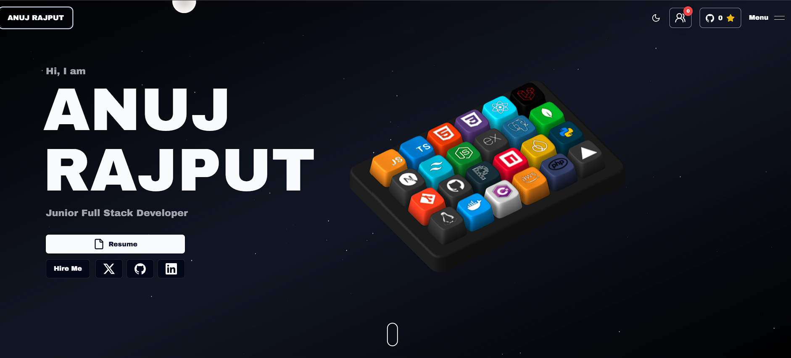

<p align="center">
  <a href="https://anuj-rajput-portfolio.vercel.app/">
    
  </a>
</p>

<p align="center">
  <strong>🌐 Live Portfolio:</strong>
  <a href="https://anuj-rajput-portfolio.vercel.app/">
    anuj-rajput-portfolio.vercel.app
  </a>
</p>

<div align="center">

# 🚀 ANUJ RAJPUT

### Full-Stack Developer

Building modern, responsive, and scalable web applications with a focus on clean interfaces, reliable backend systems, and practical user experiences.

<p>
  <a href="https://github.com/anujkumarrajput7">
    
  </a>
  <a href="https://www.linkedin.com/in/anuj-singh-721658289/">
    
  </a>
</p>

</div>

---

## 📖 About

This repository contains my personal portfolio website, created to showcase my work and journey as a **Full-Stack Developer**.

The portfolio highlights my technical skills, professional experience, featured projects, developer blogs, and contact information.

I focus on building web applications across both **frontend and backend development**, working with modern JavaScript ecosystems, APIs, databases, deployment platforms, and interactive web technologies.

---

## ✨ Highlights

- 🎨 Modern and interactive portfolio interface
- 🌐 Responsive web experience across devices
- ⚛️ React and Next.js based architecture
- 🟦 TypeScript development
- 🎯 Interactive 3D elements powered by Spline
- ✨ Smooth animations and transitions
- 📱 Responsive project showcase
- 📝 Developer blog section
- 📧 Server-side contact form with email delivery
- 🚀 Project screenshots and detailed showcases
- 🔗 GitHub and LinkedIn integration
- ☁️ Deployed with Vercel

---

## 🏗️ Technology Stack

| Category | Technologies |
|----------|--------------|
| **Frontend** | Next.js, React, TypeScript, JavaScript |
| **Styling** | Tailwind CSS, SCSS |
| **Animations** | Framer Motion, GSAP |
| **3D** | Spline |
| **Backend** | Node.js, Express.js |
| **Database** | MongoDB |
| **Email** | Resend API |
| **Tools** | Git, GitHub, VS Code |
| **Other** | REST APIs, Socket.IO |
| **Deployment** | Vercel |

---

## 💼 Experience

### Full-Stack Developer — CollegeHai.com

**April 2026 – June 2026**

Worked as a Full-Stack Developer for three months and contributed to web application development across frontend and backend workflows.

---

## 🚀 Featured Projects

### 🏠 Rentifyy

A **product rental platform** designed around products such as:

- Furniture
- Cars
- Bikes
- Air Conditioners
- TVs
- Refrigerators
- Other rental products

The project focuses on product-based rental workflows, a modern user interface, and a structured rental experience.

**Repository:**  
https://github.com/anujkumarrajput7/rentifyy-final

---

### 🤝 Collab Platform

An **Influencer & Brand Collaboration Platform** designed to connect brands and influencers through a structured collaboration workflow.

### Key Features

- 🔐 User authentication
- 👥 Role-based user workflows
- 📢 Campaign creation
- 📨 Influencer applications
- 💬 Communication
- ⭐ Reviews and feedback
- 💳 Payment workflow

**Repository:**  
https://github.com/anujkumarrajput7/collab-platform

---

## 📝 Developer Blogs

The portfolio includes a dedicated developer blog where I share topics related to:

- Full-stack development
- Programming concepts
- Real-world project experiences
- Development lessons
- Technology exploration
- Modern web application development

---

## 📂 Project Structure

```text
portfolio/
├── public/
│   ├── assets/
│   └── projects-screenshots/
│
├── src/
│   ├── app/
│   ├── components/
│   ├── content/
│   ├── data/
│   ├── hooks/
│   ├── lib/
│   └── types/
│
├── chat-server/
├── package.json
└── README.mdgit 